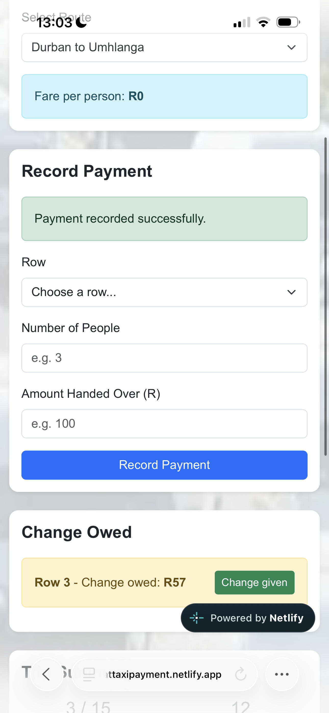

# Front Seat - Taxi Payment Tracker

Front Seat is a web application designed to help the front-seat pasenger of a taxi manage passenger payments, calculate fares and change, and track the remaining seats during a certain trip.

## Demo

Live demo: https://frontseattaxipayment.netlify.app

## Features

- Select a taxi route and view the fare per person.
- Record passenger payments by row and number of people.
- Calculate the amount due and change automatically.
- Validate payments and prevent payments that exceed the 15-seat taxi capacity.
- Track change that is still owed and mark change as given.
- Display a trip summary showing seats paid, seats remaining, total fares collected and change still owed.
- Display a message when all 15 seats have been paid.

## Tech Stack

- Languages: HTML, CSS, JavaScript
- Framework: Bootstrap 5
- Deployment: Netlify
- Version Control: Git and GitHub

## Installation

1. Install a modern web browser such as Google Chrome, Microsoft Edge or Firefox.
2. Clone the repository:

   git clone https://github.com/junior29-extrovert/front-seat.git

3. Open the project folder in Visual Studio Code.
4. Open `index.html` in a browser or use the Live Server extension in Visual Studio Code.
5. The application will load in the browser.

## Usage

1. Select a taxi route from the route dropdown.
2. Check the fare displayed for the selected route.
3. Select the passenger row.
4. Enter the number of people paying.
5. Enter the amount handed over by the passenger.
6. Click the payment button to record the payment.
7. The application calculates the amount due and any change automatically.
8. If change is owed, use the "Change given" button when the change has been handed to the passenger.
9. Use the trip summary to view seats paid, seats remaining, total fares collected and change still owed.
10. When all 15 seats have been paid, the application displays "Taxi full, let's go!".

## Known Issues and Next Steps

- The application currently stores payment information only while the page is open.
- Payment data is not saved to a database or permanent storage.
- A future version could add local storage or a database to save trip and payment information.
- A future version could include more taxi routes and additional trip management features.

## Author

Junior Molepo | GitHub: @junior29-extrovert

## Licence and Credits

Licensed under the MIT Licence.

Credits:
- Bootstrap 5 was used for the responsive layout and styling.
- Taxi background image used in the project.